## Introduction aux images numériques

Une image numérique est une représentation discrète d'une image continue, stockée sous forme de données numériques. Pour comprendre comment manipuler des images avec Python, il est essentiel de comprendre leur structure fondamentale.

### Les pixels

Le **pixel** (contraction de "picture element") est l'unité de base d'une image numérique. Une image est constituée d'une grille rectangulaire de pixels.

- Chaque pixel représente un point unique dans l'image
- Les pixels sont arrangés en lignes et colonnes
- Chaque pixel contient une valeur qui détermine sa couleur

### Systèmes de couleurs

Les images numériques utilisent différents systèmes pour représenter les couleurs :

#### RGB (Rouge, Vert, Bleu)

Le modèle RGB est additif et très couramment utilisé :

- Chaque pixel est représenté par 3 valeurs (R, G, B)
- Chaque valeur va généralement de 0 à 255 (sur 8 bits)
- La combinaison (0, 0, 0) donne du noir
- La combinaison (255, 255, 255) donne du blanc
- Exemple : (255, 0, 0) représente le rouge pur

#### RGBA

Extension du RGB avec un canal Alpha pour la transparence :

- 4 valeurs par pixel (R, G, B, A)
- A = 0 signifie totalement transparent
- A = 255 signifie totalement opaque

#### HSV (Teinte, Saturation, Valeur)

Alternative au RGB, souvent plus intuitive pour certaines applications :

- H (Hue) : la teinte, de 0° à 360°
- S (Saturation) : l'intensité de la couleur, de 0% à 100%
- V (Value) : la luminosité, de 0% à 100%

### Types d'images

#### Image binaire (1 bit par pixel)

- Seulement deux valeurs possibles : 0 (noir) ou 1 (blanc)
- Utilisée pour les documents scannés, les codes QR, etc.
- Très légère en termes de stockage

#### Image en niveaux de gris (8 bits par pixel)

- Valeurs entre 0 (noir) et 255 (blanc)
- 256 nuances de gris possibles
- Utilisée en photographie noir et blanc, imagerie médicale, etc.

#### Image en couleur (24 bits par pixel en RGB)

- 3 canaux : Rouge, Vert, Bleu
- Chaque canal a 256 valeurs possibles (8 bits)
- Permet de représenter environ 16,7 millions de couleurs (256³)

## Représentation des images avec NumPy

Les images peuvent être facilement manipulées en Python grâce aux tableaux NumPy.

### Structure de base

```python
import numpy as np
import matplotlib.pyplot as plt
```

#### Image binaire

```python
# Création d'une image binaire 10x10
binary_image = np.random.randint(0, 2, size=(10, 10))

plt.figure(figsize=(4, 4))
plt.imshow(binary_image, cmap='binary')
plt.title("Image binaire")
plt.axis('off')
plt.show()
```
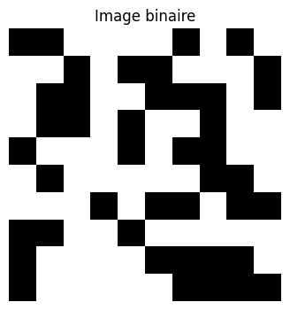

#### Image en niveaux de gris

```python
# Création d'une image en niveaux de gris 8x8
grayscale_image = np.zeros((8, 8), dtype=np.uint8)
for i in range(8):
    grayscale_image[i, :] = i * 32  # Dégradé horizontal

plt.figure(figsize=(4, 4))
plt.imshow(grayscale_image, cmap='gray')
plt.title("Image en niveaux de gris")
plt.axis('off')
plt.show()
```
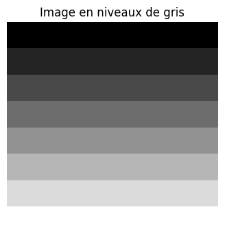

#### Image en couleur (RGB)

```python
# Création d'une image couleur 8x8x3
color_image = np.zeros((8, 8, 3), dtype=np.uint8)
color_image[0:4, 0:4] = [255, 0, 0]      # Rouge
color_image[0:4, 4:8] = [0, 255, 0]      # Vert
color_image[4:8, 0:4] = [0, 0, 255]      # Bleu
color_image[4:8, 4:8] = [255, 255, 0]    # Jaune

plt.figure(figsize=(4, 4))
plt.imshow(color_image)
plt.title("Image en couleur (RGB)")
plt.axis('off')
plt.show()
```
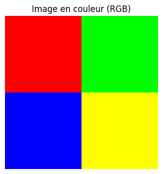

### Chargement et affichage d'images réelles

Pour travailler avec des images réelles, on peut utiliser la fonction `plt.imread` de la bibliothèque matplotlib pour les charger sous forme de tableaux NumPy.

```python
import numpy as np
import matplotlib.pyplot as plt

# Charger l'image avec imread
img_array = plt.imread('baboon.png')

# Afficher les dimensions
print(img_array.shape)      # affiche (512, 512, 3)

# Afficher l'image
plt.imshow(img_array)
plt.title("Image originale")
plt.axis('off')
plt.show()
```
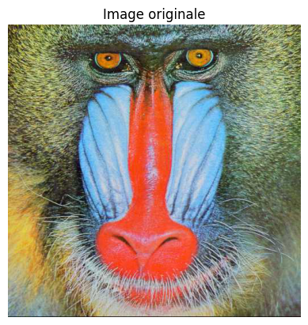

### Accès aux canaux de couleur

```python
# Dimensions de l'image : (hauteur, largeur, canaux)
height, width, channels = img_array.shape

# Accès aux canaux individuels
red_channel = img_array[:, :, 0]
green_channel = img_array[:, :, 1]
blue_channel = img_array[:, :, 2]

# Affichage des canaux
plt.figure(figsize=(15, 5))

plt.subplot(1, 3, 1)
plt.imshow(red_channel, cmap='Reds')
plt.title("Canal Rouge")
plt.axis('off')

plt.subplot(1, 3, 2)
plt.imshow(green_channel, cmap='Greens')
plt.title("Canal Vert")
plt.axis('off')

plt.subplot(1, 3, 3)
plt.imshow(blue_channel, cmap='Blues')
plt.title("Canal Bleu")
plt.axis('off')

plt.tight_layout()
plt.show()
```
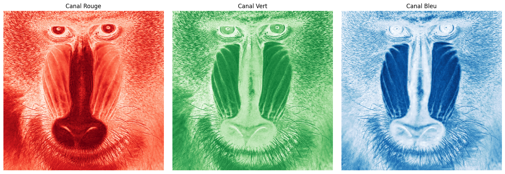

### Conversion en niveaux de gris

```python
# Méthode 1 : Moyenne des canaux
grayscale_avg = np.mean(img_array, axis=2)

# Méthode 2 : Pondération selon la perception humaine (recommandée)
grayscale_weighted = (0.299 * red_channel + 0.587 * green_channel + 0.114 * blue_channel)

# Affichage
plt.figure(figsize=(12, 6))

plt.subplot(1, 2, 1)
plt.imshow(grayscale_avg, cmap='gray')
plt.title("Niveaux de gris (moyenne simple)")
plt.axis('off')

plt.subplot(1, 2, 2)
plt.imshow(grayscale_weighted, cmap='gray')
plt.title("Niveaux de gris (pondéré)")
plt.axis('off')

plt.tight_layout()
plt.show()
```
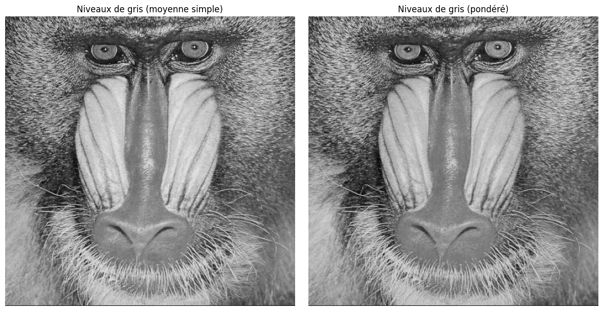

## Transformations géométriques de base

Les transformations géométriques sont des opérations qui modifient la position des pixels dans l'image.

### Symétrie horizontale

```python
# Symétrie horizontale
horizontal_flip = img_array[:, ::-1]

plt.figure(figsize=(12, 6))
plt.subplot(1, 2, 1)
plt.imshow(img_array)
plt.title("Image originale")
plt.axis('off')

plt.subplot(1, 2, 2)
plt.imshow(horizontal_flip)
plt.title("Symétrie horizontale")
plt.axis('off')

plt.tight_layout()
plt.show()
```
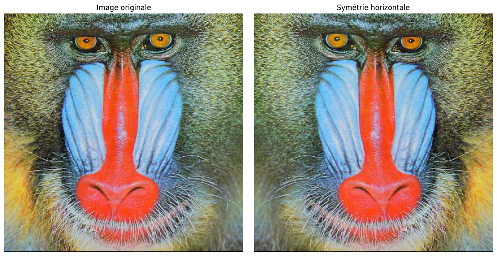

### Symétrie verticale

```python
# Symétrie verticale
vertical_flip = img_array[::-1, :]
```

### Rotation

Pour effectuer des rotations, on peut utiliser `scipy.ndimage` ou `skimage` :

```python
from scipy import ndimage

# Rotation de 45 degrés
rotated_45 = ndimage.rotate(img_array, 45)

# Rotation de 90 degrés
rotated_90 = ndimage.rotate(img_array, 90)

plt.figure(figsize=(15, 5))

plt.subplot(1, 3, 1)
plt.imshow(img_array)
plt.title("Image originale")
plt.axis('off')

plt.subplot(1, 3, 2)
plt.imshow(rotated_45)
plt.title("Rotation 45°")
plt.axis('off')

plt.subplot(1, 3, 3)
plt.imshow(rotated_90)
plt.title("Rotation 90°")
plt.axis('off')

plt.tight_layout()
plt.show()
```
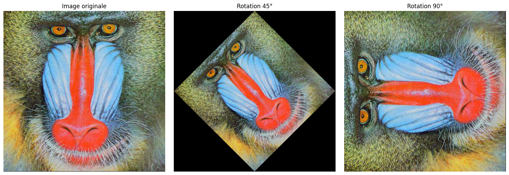

### Recadrage (crop)

```python
x0, x1 = 100, 400
y0, y1 = 50, 350

cropped = img_array[x0: x1, y0: y1] 

plt.figure(figsize=(12, 6))

plt.subplot(1, 2, 1)
plt.imshow(img_array)
plt.title("Image originale")
plt.axis('off')

plt.subplot(1, 2, 2)
plt.imshow(cropped)
plt.title("Image recadrée")
plt.axis('off')

plt.tight_layout()
plt.show()
```
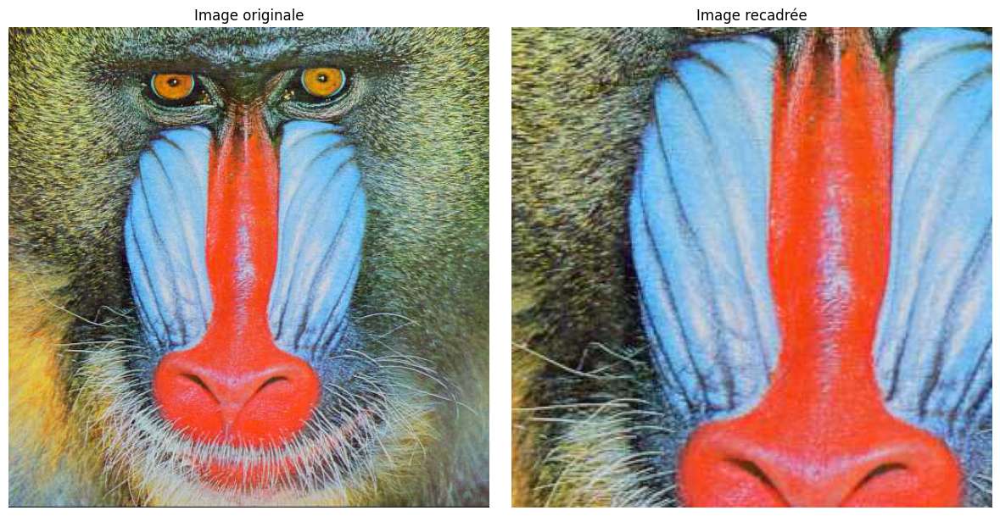

## Convolution et filtres

La convolution est une opération mathématique fondamentale en traitement d'image. Elle consiste à appliquer un "noyau" (kernel) à chaque pixel de l'image pour calculer une nouvelle valeur en fonction des pixels voisins.

### Principe de la convolution

La convolution 2D est définie par :

$$(I * K)(x, y) = \sum_{i=0}^{a} \sum_{j=0}^{b} I(x+i, y+j) \cdot K(i, j)$$

Où :
- $I$ est l'image d'entrée
- $K$ est le noyau de convolution
- $(x, y)$ sont les coordonnées du pixel
- $a$ et $b$ définissent la taille du noyau

### Implémentation manuelle d'une convolution

```python
def convolve2d(image, kernel):
    # Obtenir les dimensions
    i_height, i_width = image.shape
    k_height, k_width = kernel.shape
    
    # Calculer les dimensions de l'image de sortie
    o_height = i_height - k_height + 1
    o_width = i_width - k_width + 1
    
    # Initialiser l'image de sortie
    output = np.zeros((o_height, o_width))
    
    # Appliquer la convolution
    for y in range(o_height):
        for x in range(o_width):
            # Extraire la région de l'image
            region = image[y:y+k_height, x:x+k_width]
            # Multiplier par le noyau et faire la somme
            output[y, x] = np.sum(region * kernel)
            
    return output
```

### Utilisation de SciPy pour la convolution

```python
from scipy import ndimage

def apply_filter(image, kernel):
    # Si l'image est en couleur, appliquer le filtre sur chaque canal
    if len(image.shape) == 3:
        result = np.zeros_like(image)
        for i in range(image.shape[2]):
            result[:, :, i] = ndimage.convolve(image[:, :, i], kernel)
        return result
    else:
        # Si l'image est en niveaux de gris
        return ndimage.convolve(image, kernel)
```

### Filtre de flou (moyenneur)

Le filtre moyenneur est un filtre simple qui remplace chaque pixel par la moyenne de ses voisins.

```python
# Noyau de flou moyenneur 3x3
blur_kernel = np.ones((3, 3)) / 9

# Application du filtre
blurred_image = apply_filter(grayscale_weighted, blur_kernel)

plt.figure(figsize=(12, 6))

plt.subplot(1, 2, 1)
plt.imshow(grayscale_weighted, cmap='gray')
plt.title("Image originale")
plt.axis('off')

plt.subplot(1, 2, 2)
plt.imshow(blurred_image, cmap='gray')
plt.title("Image floutée (filtre moyenneur)")
plt.axis('off')

plt.tight_layout()
plt.show()
```
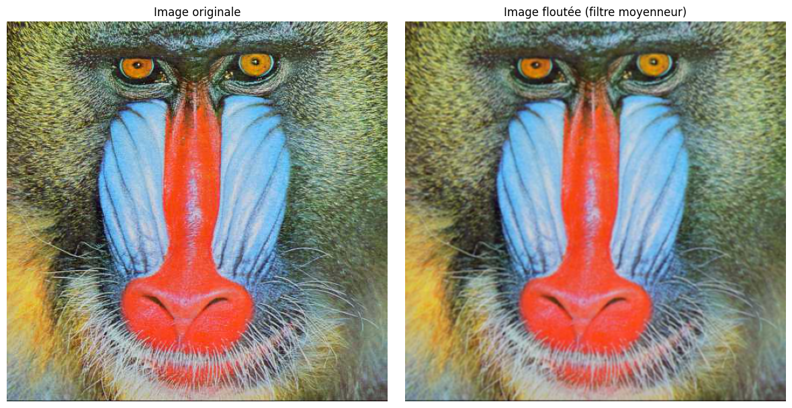

### Filtre gaussien

Le filtre gaussien est un filtre de flou qui utilise une distribution gaussienne pour pondérer les pixels voisins.

```python
from scipy.ndimage import gaussian_filter

# Application du filtre gaussien avec différents écarts-types
gaussian_blur_1 = gaussian_filter(grayscale_weighted, sigma=1)
gaussian_blur_3 = gaussian_filter(grayscale_weighted, sigma=3)
gaussian_blur_5 = gaussian_filter(grayscale_weighted, sigma=5)

plt.figure(figsize=(20, 5))

plt.subplot(1, 4, 1)
plt.imshow(grayscale_weighted, cmap='gray')
plt.title("Image originale")
plt.axis('off')

plt.subplot(1, 4, 2)
plt.imshow(gaussian_blur_1, cmap='gray')
plt.title("Flou gaussien (σ=1)")
plt.axis('off')

plt.subplot(1, 4, 3)
plt.imshow(gaussian_blur_3, cmap='gray')
plt.title("Flou gaussien (σ=3)")
plt.axis('off')

plt.subplot(1, 4, 4)
plt.imshow(gaussian_blur_5, cmap='gray')
plt.title("Flou gaussien (σ=5)")
plt.axis('off')

plt.tight_layout()
plt.show()
```
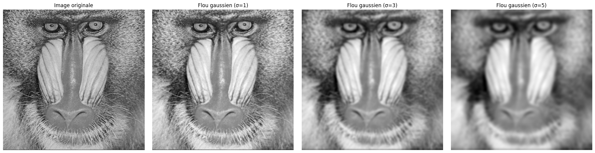

### Détection de contours

La détection de contours est une technique qui identifie les transitions brusques d'intensité dans une image.

#### Filtre de Sobel

Le filtre de Sobel calcule le gradient de l'intensité de l'image pour mettre en évidence les changements rapides.

```python
# Noyaux de Sobel
sobel_x = np.array([[-1, 0, 1],
                    [-2, 0, 2],
                    [-1, 0, 1]])

sobel_y = np.array([[-1, -2, -1],
                     [0,  0,  0],
                     [1,  2,  1]])

# Application des filtres
edges_x = apply_filter(grayscale_weighted, sobel_x)
edges_y = apply_filter(grayscale_weighted, sobel_y)

# Magnitude du gradient
edges_magnitude = np.sqrt(edges_x**2 + edges_y**2)
edges_magnitude = edges_magnitude / edges_magnitude.max() * 255  # Normalisation

plt.figure(figsize=(20, 5))

plt.subplot(1, 4, 1)
plt.imshow(grayscale_weighted, cmap='gray')
plt.title("Image originale")
plt.axis('off')

plt.subplot(1, 4, 2)
plt.imshow(np.abs(edges_x), cmap='gray')
plt.title("Gradient horizontal (Sobel X)")
plt.axis('off')

plt.subplot(1, 4, 3)
plt.imshow(np.abs(edges_y), cmap='gray')
plt.title("Gradient vertical (Sobel Y)")
plt.axis('off')

plt.subplot(1, 4, 4)
plt.imshow(edges_magnitude, cmap='gray')
plt.title("Magnitude du gradient")
plt.axis('off')

plt.tight_layout()
plt.show()
```
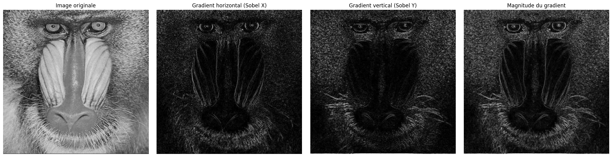

## Ressources supplémentaires

- Documentation de NumPy : [https://numpy.org/doc/stable/](https://numpy.org/doc/stable/)
- Documentation de scikit-image : [https://scikit-image.org/docs/stable/](https://scikit-image.org/docs/stable/)
- Documentation de SciPy : [https://docs.scipy.org/doc/scipy/](https://docs.scipy.org/doc/scipy/)
- Convolution : [Wikipedia](https://en.wikipedia.org/wiki/Kernel_(image_processing)#Convolution)
